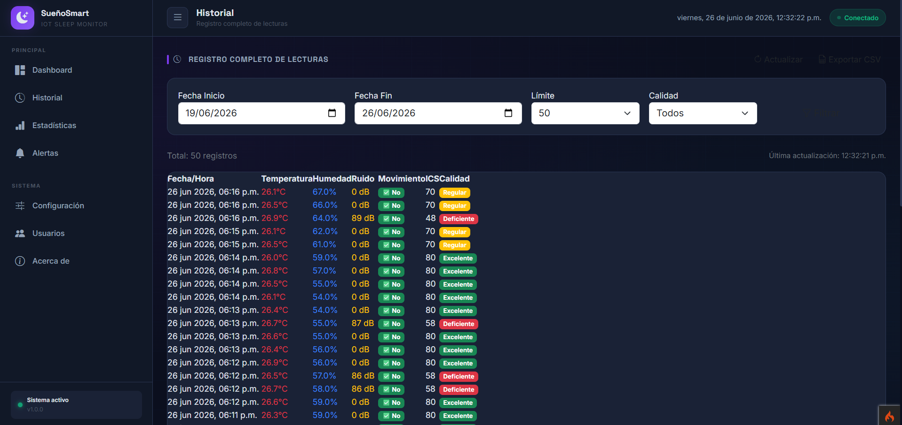
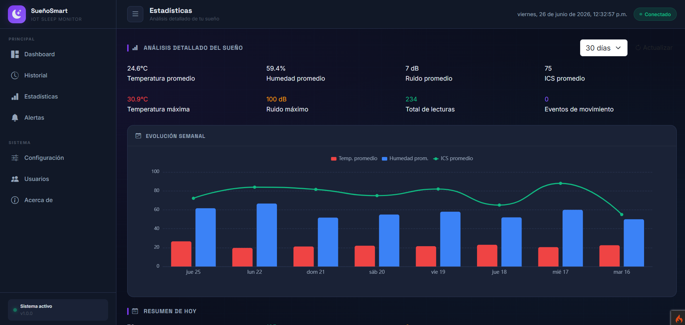
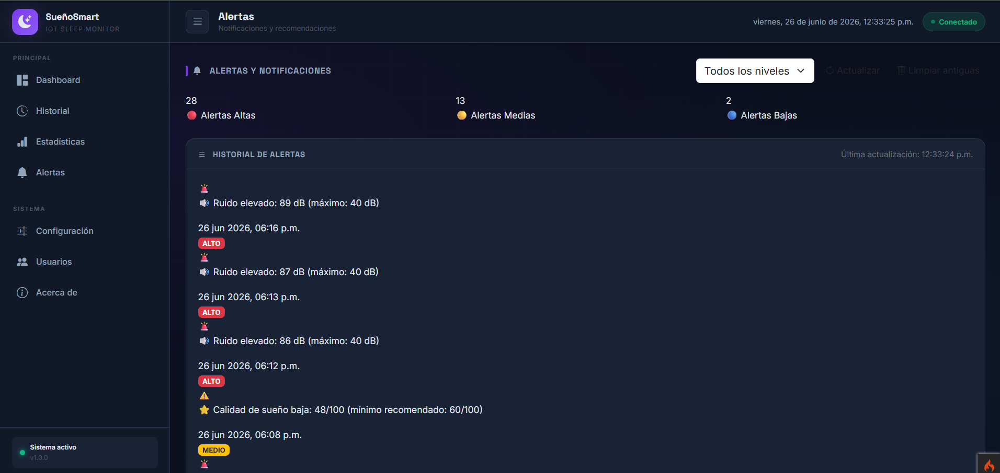
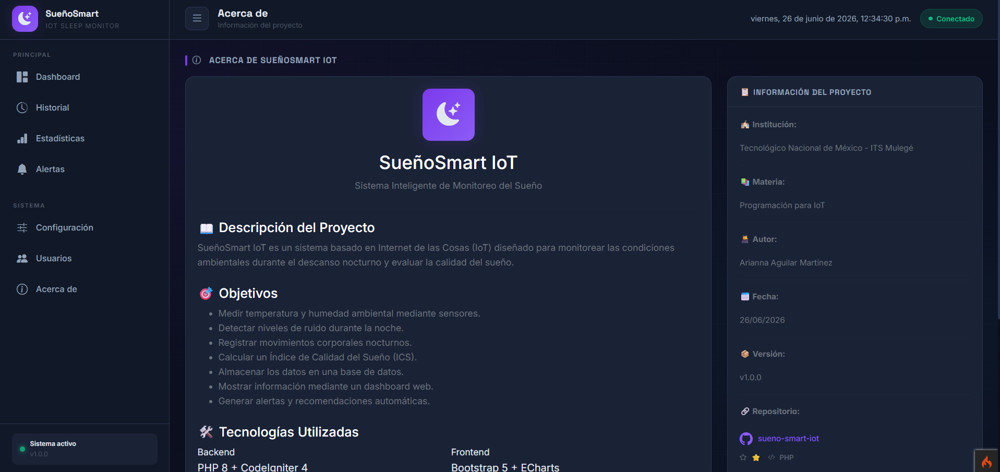

# 🌙 SueñoSmart IoT - Sistema Inteligente de Monitoreo del Sueño

## 🎯 Descripción del Problema

Actualmente muchas personas presentan **problemas de sueño sin ser conscientes de ello**, lo que afecta su salud física, emocional y rendimiento académico o laboral. Los dispositivos comerciales para monitoreo del sueño suelen ser **costosos** o requieren el uso de **accesorios corporales incómodos**.

Además, **factores ambientales** como la temperatura, humedad, ruido y movimiento durante la noche influyen directamente en la calidad del descanso, pero normalmente no son monitoreados de forma continua.

Por ello surge la necesidad de desarrollar un **sistema inteligente basado en IoT** que permita monitorear las condiciones ambientales del dormitorio y generar recomendaciones para mejorar la calidad del sueño de manera **económica, accesible y no invasiva**.

---

## 🎯 Objetivos

### Objetivo General

Desarrollar un **sistema inteligente basado en IoT** capaz de monitorear las condiciones ambientales y físicas relacionadas con el descanso nocturno para evaluar la calidad del sueño y generar recomendaciones automáticas.

### Objetivos Específicos

- ✅ Medir **temperatura y humedad** ambiental mediante sensores.
- ✅ Detectar **niveles de ruido** durante la noche.
- ✅ Registrar **movimientos corporales** nocturnos.
- ✅ Calcular un **Índice de Calidad del Sueño (ICS)**.
- ✅ Almacenar los datos en una **base de datos MySQL**.
- ✅ Mostrar información mediante un **dashboard web**.
- ✅ Generar **alertas y recomendaciones** automáticas.
- ✅ Implementar indicadores visuales mediante **LED RGB** y **pantalla OLED**.

---

## 🏗️ Arquitectura del Sistema

---

## 🛠️ Tecnologías Utilizadas

### Backend
| Tecnología | Versión | Descripción |
|------------|---------|-------------|
| **PHP** | 8.0+ | Lenguaje de programación |
| **CodeIgniter 4** | 4.7.3 | Framework MVC |
| **MySQL** | 5.7+ | Base de datos relacional |
| **phpMyAdmin** | 5.2+ | Gestor de base de datos |

### Frontend
| Tecnología | Versión | Descripción |
|------------|---------|-------------|
| **HTML5** | - | Estructura de páginas |
| **CSS3** | - | Estilos y animaciones |
| **JavaScript** | ES6+ | Lógica de cliente |
| **Bootstrap 5** | 5.3.2 | Framework CSS |
| **Apache ECharts** | 5.4.3 | Gráficas y visualizaciones |

### Hardware
| Componente | Descripción |
|------------|-------------|
| **ESP32 DevKit V1** | Microcontrolador principal |
| **DHT11** | Sensor de temperatura y humedad |
| **KY-038** | Sensor de sonido (ruido) |
| **SW-420** | Sensor de vibración (movimiento) |
| **LED RGB** | Indicador visual de calidad de sueño |
| **OLED SSD1306** | Pantalla 128x64 I2C |

### Herramientas de Desarrollo
| Herramienta | Descripción |
|-------------|-------------|
| **Visual Studio Code** | Editor de código |
| **Arduino IDE** | Programación del ESP32 |
| **XAMPP** | Servidor local (Apache + MySQL) |
| **Git** | Control de versiones |
| **Thunder Client** | Prueba de APIs |

---

## 🔌 Hardware - Sensores y Actuadores

### Componentes y Conexiones

| Componente | Pin ESP32 | Función |
|------------|-----------|---------|
| **DHT11** | GPIO 4 | Temperatura y humedad |
| **KY-038 (AO)** | GPIO 34 | Detección de ruido (analógico) |
| **SW-420 (DO)** | GPIO 27 | Detección de movimiento/vibración |
| **LED RGB (R)** | GPIO 25 | Indicador rojo (sueño deficiente) |
| **LED RGB (G)** | GPIO 26 | Indicador verde (sueño excelente) |
| **LED RGB (B)** | GPIO 33 | Indicador azul (sueño regular) |
| **OLED SSD1306 (SDA)** | GPIO 21 | Comunicación I2C - Datos |
| **OLED SSD1306 (SCL)** | GPIO 22 | Comunicación I2C - Clock |

### Esquema de Conexiones

.png>)

### Diagrama de Actividad - Dashboard

Vista del Dashboard

Vista del Historial

Vista de Estadística

Vista de Alertas

Vista de Configuración

Vista de Usuarios

Vista de Acerca de
