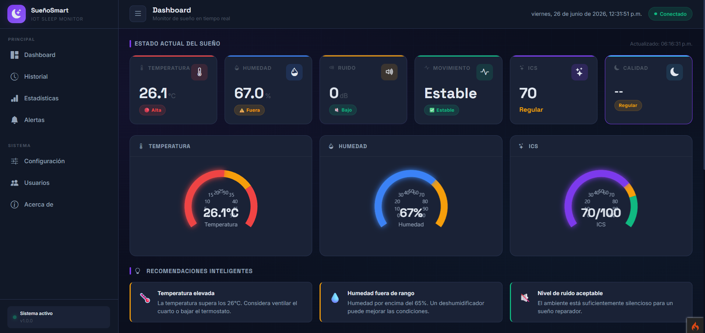

# 🌙 SueñoSmart IoT - Sistema Inteligente de Monitoreo del Sueño

---

## 🎯 Descripción del Problema

Actualmente muchas personas presentan **problemas de sueño sin ser conscientes de ello**, lo que afecta su salud física, emocional y rendimiento académico o laboral. Los dispositivos comerciales para monitoreo del sueño suelen ser **costosos** o requieren el uso de **accesorios corporales incómodos**.

Además, **factores ambientales** como la temperatura, humedad, ruido y movimiento durante la noche influyen directamente en la calidad del descanso, pero normalmente no son monitoreados de forma continua.

Por ello surge la necesidad de desarrollar un **sistema inteligente basado en IoT** que permita monitorear las condiciones ambientales del dormitorio y generar recomendaciones para mejorar la calidad del sueño de manera **económica, accesible y no invasiva**.

---

## 🎯 Objetivos

### Objetivo General

Desarrollar un **sistema inteligente basado en IoT** capaz de monitorear las condiciones ambientales y físicas relacionadas con el descanso nocturno para evaluar la calidad del sueño y generar recomendaciones automáticas.

### Objetivos Específicos

- ✅ Medir **temperatura y humedad** ambiental mediante sensores.
- ✅ Detectar **niveles de ruido** durante la noche.
- ✅ Registrar **movimientos corporales** nocturnos.
- ✅ Calcular un **Índice de Calidad del Sueño (ICS)**.
- ✅ Almacenar los datos en una **base de datos MySQL**.
- ✅ Mostrar información mediante un **dashboard web**.
- ✅ Generar **alertas y recomendaciones** automáticas.
- ✅ Implementar indicadores visuales mediante **LED RGB** y **pantalla OLED**.

---

## 🏗️ Arquitectura del Sistema


### Componentes del Sistema

| Componente | Descripción |
|------------|-------------|
| **Hardware (ESP32)** | Microcontrolador con sensores y actuadores |
| **Backend (API REST)** | Servidor con CodeIgniter 4 y PHP 8 |
| **Base de Datos** | MySQL para almacenar lecturas y alertas |
| **Frontend (Dashboard)** | Interfaz web con Bootstrap 5 y ECharts |

### Flujo de Datos

ESP32 → POST /api/lecturas → API → Validar → Guardar en BD → Generar Alertas → Dashboard

---

## 🛠️ Tecnologías Utilizadas

### Backend
| Tecnología | Versión | Descripción |
|------------|---------|-------------|
| **PHP** | 8.0+ | Lenguaje de programación |
| **CodeIgniter 4** | 4.7.3 | Framework MVC |
| **MySQL** | 5.7+ | Base de datos relacional |
| **phpMyAdmin** | 5.2+ | Gestor de base de datos |

### Frontend
| Tecnología | Versión | Descripción |
|------------|---------|-------------|
| **HTML5** | - | Estructura de páginas |
| **CSS3** | - | Estilos y animaciones |
| **JavaScript** | ES6+ | Lógica de cliente |
| **Bootstrap 5** | 5.3.2 | Framework CSS |
| **Apache ECharts** | 5.4.3 | Gráficas y visualizaciones |

### Hardware
| Componente | Descripción |
|------------|-------------|
| **ESP32 DevKit V1** | Microcontrolador principal |
| **DHT11** | Sensor de temperatura y humedad |
| **KY-038** | Sensor de sonido (ruido) |
| **SW-420** | Sensor de vibración (movimiento) |
| **LED RGB** | Indicador visual de calidad de sueño |
| **OLED SSD1306** | Pantalla 128x64 I2C |

### Herramientas de Desarrollo
| Herramienta | Descripción |
|-------------|-------------|
| **Visual Studio Code** | Editor de código |
| **Arduino IDE** | Programación del ESP32 |
| **XAMPP** | Servidor local (Apache + MySQL) |
| **Git** | Control de versiones |
| **Thunder Client** | Prueba de APIs |

---

## 🔌 Hardware - Sensores y Actuadores

### Componentes y Conexiones

| Componente | Pin ESP32 | Función |
|------------|-----------|---------|
| **DHT11** | GPIO 4 | Temperatura y humedad |
| **KY-038 (AO)** | GPIO 34 | Detección de ruido (analógico) |
| **SW-420 (DO)** | GPIO 27 | Detección de movimiento/vibración |
| **LED RGB (R)** | GPIO 25 | Indicador rojo (sueño deficiente) |
| **LED RGB (G)** | GPIO 26 | Indicador verde (sueño excelente) |
| **LED RGB (B)** | GPIO 33 | Indicador azul (sueño regular) |
| **OLED SSD1306 (SDA)** | GPIO 21 | Comunicación I2C - Datos |
| **OLED SSD1306 (SCL)** | GPIO 22 | Comunicación I2C - Clock |

### Esquema de Conexiones


---

## 📐 Diagramas del Sistema

### Diagrama de Casos de Uso


*Los actores principales son: Usuario, Administrador, ESP32 y Sistema (Core).*

### Diagrama de Actividad


*Flujo de actividades del dashboard y consulta de datos.*

### Diagrama de Secuencia


*Comunicación entre ESP32, API, Servicio de Alertas y Base de Datos.*

### Diagrama de Clases


*Estructura de clases del sistema MVC.*

### Mapa del Sitio


*Navegación del sistema web.*

### Diseño de Base de Datos


*Estructura de las tablas: lecturas, alertas, configuraciones y usuarios.*

### Diseño Electrónico


*Conexiones de componentes electrónicos con ESP32.*

---

## 📸 Capturas de Pantalla

### Dashboard Principal



*Vista principal del dashboard con métricas en tiempo real, gauges y gráficas.*

### Historial de Lecturas


*Tabla con el historial completo de lecturas, filtros por fecha y exportación a CSV.*

### Estadísticas


*Gráficas de evolución semanal, promedios y resumen del día.*

### Alertas


*Lista de alertas generadas automáticamente con filtros por nivel.*

### Configuración


*Configuración de umbrales de alerta para temperatura, humedad, ruido y movimiento.*

### Usuarios


*Gestión de usuarios del sistema con CRUD completo.*

### Acerca de


*Información del proyecto, tecnologías utilizadas y autoría.*

---

## 🚀 Instalación y Ejecución

### Requisitos Previos

- **XAMPP** (Apache + MySQL) o similar
- **PHP 8.0 o superior**
- **Composer** (gestor de dependencias de PHP)
- **Arduino IDE** (para programar el ESP32)
- **Git** (opcional, para clonar el repositorio)

### Paso 1: Clonar el repositorio

```bash
git clone https://github.com/AriannaAguilarM/sms-iot.git
cd sms-iot

### Paso 2: Configurar la base de datos
- Abrir phpMyAdmin (http://localhost/phpmyadmin)
- Crear una base de datos llamada sims_iot
- Ejecutar las migraciones:

```bash
php spark migrate

### Paso 3: Configurar el archivo .env
Crear o modificar el archivo .env en la raíz del proyecto:

```env
CI_ENVIRONMENT = development

app.baseURL = 'http://localhost:8080/'

database.default.hostname = localhost
database.default.database = sims_iot
database.default.username = root
database.default.password = 
database.default.DBDriver = MySQLi
database.default.port = 3306

### Paso 4: Ejecutar el servidor
```bash
php spark serve --host=0.0.0.0 

### Paso 5: Configurar el ESP32
- Abrir Arduino IDE
- Abrir el archivo sketch/sms-iot.ino
- Configurar las credenciales WiFi:

```cpp
const char* ssid = "TU_WIFI_SSID";
const char* password = "TU_WIFI_PASSWORD";
Configurar la URL de la API (IP de tu PC):

```cpp
String serverName = "http://IP.de.tu.PC:8080/api/lecturas";

- Conectar los componentes según el diagrama de conexiones
- Subir el código al ESP32

### Paso 6: Acceder al Dashboard
- Abrir el navegador y acceder a:
http://localhost:8080/dashboard