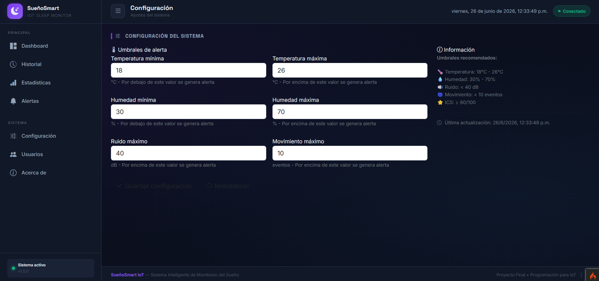
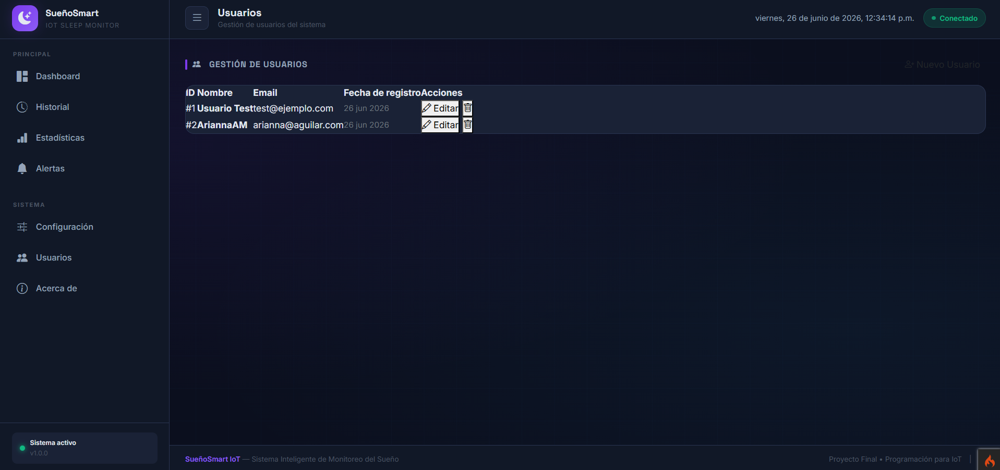

# 🌙 SueñoSmart IoT - Sistema Inteligente de Monitoreo del Sueño

---

## 🎯 Descripción del Problema

Actualmente muchas personas presentan **problemas de sueño sin ser conscientes de ello**, lo que afecta su salud física, emocional y rendimiento académico o laboral. Los dispositivos comerciales para monitoreo del sueño suelen ser **costosos** o requieren el uso de **accesorios corporales incómodos**.

Además, **factores ambientales** como la temperatura, humedad, ruido y movimiento durante la noche influyen directamente en la calidad del descanso, pero normalmente no son monitoreados de forma continua.

Por ello surge la necesidad de desarrollar un **sistema inteligente basado en IoT** que permita monitorear las condiciones ambientales del dormitorio y generar recomendaciones para mejorar la calidad del sueño de manera **económica, accesible y no invasiva**.

---

## 🎯 Objetivos

### Objetivo General

Desarrollar un **sistema inteligente basado en IoT** capaz de monitorear las condiciones ambientales y físicas relacionadas con el descanso nocturno para evaluar la calidad del sueño y generar recomendaciones automáticas.

### Objetivos Específicos

- ✅ Medir **temperatura y humedad** ambiental mediante sensores.
- ✅ Detectar **niveles de ruido** durante la noche.
- ✅ Registrar **movimientos corporales** nocturnos.
- ✅ Calcular un **Índice de Calidad del Sueño (ICS)**.
- ✅ Almacenar los datos en una **base de datos MySQL**.
- ✅ Mostrar información mediante un **dashboard web**.
- ✅ Generar **alertas y recomendaciones** automáticas.
- ✅ Implementar indicadores visuales mediante **LED RGB** y **pantalla OLED**.

---

## 🏗️ Arquitectura del Sistema


### Componentes del Sistema

| Componente | Descripción |
|------------|-------------|
| **Hardware (ESP32)** | Microcontrolador con sensores y actuadores |
| **Backend (API REST)** | Servidor con CodeIgniter 4 y PHP 8 |
| **Base de Datos** | MySQL para almacenar lecturas y alertas |
| **Frontend (Dashboard)** | Interfaz web con Bootstrap 5 y ECharts |

### Flujo de Datos

ESP32 → POST /api/lecturas → API → Validar → Guardar en BD → Generar Alertas → Dashboard

---

## 🛠️ Tecnologías Utilizadas

### Backend
| Tecnología | Versión | Descripción |
|------------|---------|-------------|
| **PHP** | 8.0+ | Lenguaje de programación |
| **CodeIgniter 4** | 4.7.3 | Framework MVC |
| **MySQL** | 5.7+ | Base de datos relacional |
| **phpMyAdmin** | 5.2+ | Gestor de base de datos |

### Frontend
| Tecnología | Versión | Descripción |
|------------|---------|-------------|
| **HTML5** | - | Estructura de páginas |
| **CSS3** | - | Estilos y animaciones |
| **JavaScript** | ES6+ | Lógica de cliente |
| **Bootstrap 5** | 5.3.2 | Framework CSS |
| **Apache ECharts** | 5.4.3 | Gráficas y visualizaciones |

### Hardware
| Componente | Descripción |
|------------|-------------|
| **ESP32 DevKit V1** | Microcontrolador principal |
| **DHT11** | Sensor de temperatura y humedad |
| **KY-038** | Sensor de sonido (ruido) |
| **SW-420** | Sensor de vibración (movimiento) |
| **LED RGB** | Indicador visual de calidad de sueño |
| **OLED SSD1306** | Pantalla 128x64 I2C |

### Herramientas de Desarrollo
| Herramienta | Descripción |
|-------------|-------------|
| **Visual Studio Code** | Editor de código |
| **Arduino IDE** | Programación del ESP32 |
| **XAMPP** | Servidor local (Apache + MySQL) |
| **Git** | Control de versiones |
| **Thunder Client** | Prueba de APIs |

---

## 🔌 Hardware - Sensores y Actuadores

### Componentes y Conexiones

| Componente | Pin ESP32 | Función |
|------------|-----------|---------|
| **DHT11** | GPIO 4 | Temperatura y humedad |
| **KY-038 (AO)** | GPIO 34 | Detección de ruido (analógico) |
| **SW-420 (DO)** | GPIO 27 | Detección de movimiento/vibración |
| **LED RGB (R)** | GPIO 25 | Indicador rojo (sueño deficiente) |
| **LED RGB (G)** | GPIO 26 | Indicador verde (sueño excelente) |
| **LED RGB (B)** | GPIO 33 | Indicador azul (sueño regular) |
| **OLED SSD1306 (SDA)** | GPIO 21 | Comunicación I2C - Datos |
| **OLED SSD1306 (SCL)** | GPIO 22 | Comunicación I2C - Clock |

### Esquema de Conexiones


---

### Diseño de Base de Datos

### 🧑‍💻 Tabla: usuarios
| Campo     | Tipo           | Descripción                          |
|-----------|----------------|--------------------------------------|
| id        | INT (PK)       | Identificador único del usuario      |
| nombre    | VARCHAR(100)   | Nombre del usuario                   |
| correo    | VARCHAR(100)   | Correo electrónico (único)          |
| password  | VARCHAR(255)   | Contraseña encriptada               |

### 🌙 Tabla: lecturas
| Campo           | Tipo           | Descripción                                      |
|----------------|----------------|--------------------------------------------------|
| id             | INT (PK)       | Identificador de la lectura                      |
| temperatura    | FLOAT          | Temperatura registrada por el sensor            |
| humedad        | FLOAT          | Nivel de humedad                                 |
| ruido          | FLOAT          | Nivel de ruido ambiental                         |
| movimiento     | INT            | Detección de movimiento (0 o 1)                 |
| indice_sueno   | FLOAT          | Índice calculado de calidad del sueño           |
| fecha          | DATETIME       | Fecha y hora de la lectura                      |

### 🚨 Tabla: alertas
| Campo     | Tipo           | Descripción                                      |
|-----------|----------------|--------------------------------------------------|
| id        | INT (PK)       | Identificador de la alerta                       |
| mensaje   | VARCHAR(255)   | Descripción de la alerta                         |
| nivel     | VARCHAR(50)    | Nivel de severidad (bajo, medio, alto)          |
| fecha     | DATETIME       | Fecha de generación de la alerta                |

### ⚙️ Tabla: configuraciones
| Campo                 | Tipo   | Descripción                                   |
|----------------------|--------|-----------------------------------------------|
| id                   | INT    | Identificador de configuración                |
| temperatura_minima   | FLOAT  | Umbral mínimo de temperatura                  |
| temperatura_maxima   | FLOAT  | Umbral máximo de temperatura                  |
| humedad_minima       | FLOAT  | Umbral mínimo de humedad                      |
| humedad_maxima       | FLOAT  | Umbral máximo de humedad                      |
| ruido_maximo         | FLOAT  | Nivel máximo permitido de ruido               |
| movimiento_maximo    | INT    | Máximo de movimientos permitidos              |

---

## 📸 Capturas de Pantalla

### Dashboard Principal


*Vista principal del dashboard con métricas en tiempo real, gauges y gráficas.*

### Historial de Lecturas


*Tabla con el historial completo de lecturas, filtros por fecha y exportación a CSV.*

### Estadísticas


*Gráficas de evolución semanal, promedios y resumen del día.*

### Alertas


*Lista de alertas generadas automáticamente con filtros por nivel.*

### Configuración



*Configuración de umbrales de alerta para temperatura, humedad, ruido y movimiento.*

### Usuarios



*Gestión de usuarios del sistema con CRUD completo.*

### Acerca de


*Información del proyecto, tecnologías utilizadas y autoría.*

---

## 🚀 Instalación y Ejecución

### 📋 Requisitos Previos

Antes de comenzar, asegúrate de contar con las siguientes herramientas instaladas:

- **XAMPP** (Apache + MySQL) o cualquier servidor compatible.
- **PHP 8.0 o superior**.
- **Composer** (gestor de dependencias de PHP).
- **Arduino IDE** (para programar el ESP32).
- **Git** (opcional, para clonar el repositorio).

---

### 📥 Paso 1: Clonar el repositorio

Clona el proyecto desde GitHub y accede al directorio:

```bash
git clone https://github.com/AriannaAguilarM/sms-iot.git
cd sms-iot
```

---

### 🗄️ Paso 2: Configurar la Base de Datos

1. Abrir **phpMyAdmin**:

   ```
   http://localhost/phpmyadmin
   ```

2. Crear una base de datos llamada:

   ```
   sms_iot
   ```

3. Ejecutar las migraciones de CodeIgniter:

```bash
php spark migrate
```

---

### ⚙️ Paso 3: Configurar el archivo `.env`

Crear (o modificar) el archivo `.env` ubicado en la raíz del proyecto.

```env
CI_ENVIRONMENT = development

app.baseURL = 'http://localhost:8080/'

database.default.hostname = localhost
database.default.database = sms_iot
database.default.username = root
database.default.password =
database.default.DBDriver = MySQLi
database.default.port = 3306
```

> **Nota:** Verifica que el nombre de la base de datos coincida con la creada en phpMyAdmin.

---

### ▶️ Paso 4: Ejecutar el servidor

Iniciar el servidor de desarrollo de CodeIgniter 4:

```bash
php spark serve --host=0.0.0.0
```

Una vez iniciado, acceder desde el navegador a:

```
http://localhost:8080
```

---

### 📡 Paso 5: Configurar el ESP32

1. Abrir **Arduino IDE**.
2. Abrir el archivo principal del proyecto del ESP32.
3. Configurar las credenciales de la red Wi-Fi:

```cpp
const char* ssid = "TU_WIFI_SSID";
const char* password = "TU_WIFI_PASSWORD";
```

4. Configurar la dirección de la API REST (utilizando la dirección IP del equipo donde se ejecuta CodeIgniter):

```cpp
String serverName = "http://IP_DE_TU_PC:8080/api/lecturas";
```

**Ejemplo:**

```cpp
String serverName = "http://192.168.1.100:8080/api/lecturas";
```

5. Conectar los sensores y actuadores siguiendo el **diagrama electrónico** del proyecto.
6. Compilar y cargar el programa al ESP32.

---

### 💻 Paso 6: Acceder al Dashboard Web

Una vez que el servidor esté en ejecución, abrir el navegador y acceder a:

```
http://localhost:8080/dashboard
```

Desde el Dashboard será posible:

- 📊 Visualizar las lecturas de los sensores en tiempo real.
- 📈 Consultar estadísticas del monitoreo del sueño.
- 🚨 Visualizar alertas generadas por el sistema.
- ⚙️ Configurar los parámetros de monitoreo.
- 👤 Administrar los usuarios registrados.

---

## ✅ Verificación de funcionamiento

Si la instalación fue correcta, el sistema deberá cumplir con lo siguiente:

- ✅ La base de datos `sms_iot` contiene todas las tablas creadas mediante las migraciones.
- ✅ El servidor de CodeIgniter 4 responde correctamente en `http://localhost:8080`.
- ✅ El ESP32 envía lecturas a la API REST.
- ✅ Las lecturas se almacenan en la base de datos.
- ✅ El Dashboard muestra la información actualizada en tiempo real.